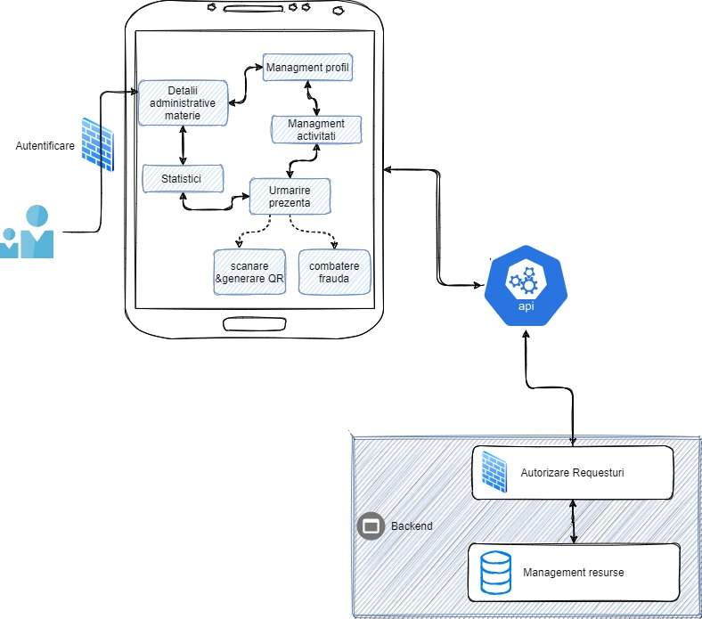
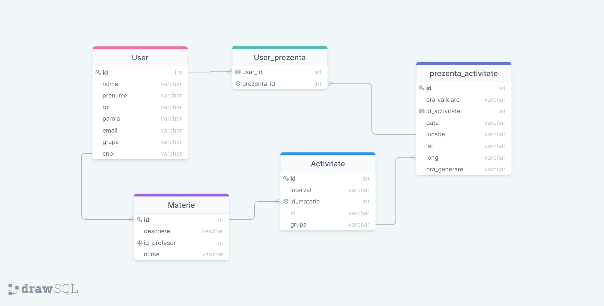

  # QResent

QResent este o aplicatie de tip mobile ce vine in intampinarea problemelor digitalizarii sistemului educational. Aceasta este adresata atat studentilor, profesorilor cat si a adminitratorilor inregistrati. In functie de rolul utilizatorului aplicatia ofera diverse avantaje, precum: 
  - urmarire atenta a informatiilor de actualitate si a statisticilor oferite de fiecare materie
  - un sistem de identificare a studentilor prezenti in cadrul activitatiilor prin scanarea codurilor QR
  - configurarea materiilor (informatii utile: cerinte minime, intervale orare)
  - descarcarea listelor de prezente pentru orice activitate din trecut

## Tehnologii
[Frontend](https://github.com/iuliiaioana/QResentF)
- [React 17](https://reactjs.org/blog/2020/10/20/react-v17.html)
- [MUI](https://mui.com)
- [Ant Design](https://ant.design)
- [QR React](https://www.npmjs.com/package/react-qr-code)
- [ReactDOM](https://reactjs.org/docs/react-dom.html)
- [Testing Library](https://testing-library.com)

  
[Backend](https://github.com/iuliiaioana/QResentB)
- [Pyton 3.8.10](https://www.python.org/downloads/release/python-3810/)
- [PEP8](https://www.python.org/dev/peps/pep-0008/)
- [Flask](https://flask.palletsprojects.com/en/2.0.x/)
- [PyJWT](https://pyjwt.readthedocs.io/en/stable/)
- [Marshmallow](https://flask-marshmallow.readthedocs.io/en/latest/)
- [gunicorn](https://docs.gunicorn.org/en/20.1.0/)
- [Deploy with Heroku](https://www.heroku.com/home)


[Baza de Date](https://drawsql.app/asdas-2/diagrams/mps):
  - [SQLite](https://www.sqlite.org/index.html)
  - [Flask-SQLAlchemy](https://flask-sqlalchemy.palletsprojects.com/en/2.x/)
  - [DB Browser for SQLite](https://sqlitebrowser.org/)
 
## Instalarea proiectului

```bash
  git clone https://github.com/iuliiaioana/QResentB.git
  cd QResentB
  pip install -r requirements.txt
```

## Arhitectura Aplicatie
Sablonul arhitectural ales pentru dezvoltarea acestui proiect a fost cel de back-end și front-end. 



Utilizatorul interacționează cu aplicația prin intermediul paginilor din front-end, unde se colectează inițial datele introduse/cerute de acesta. Pe baza acestora, din front-end se trimit cereri HTTP către back-end.
În back-end aplicația interacționează cu baza de date și trimite răspunsuri înapoi către front-end pentru a le interfața cu utilizatorul. Acțiuni care se fac din back-end sunt:
Modificarea bazei de date (ex: la crearea unui nou cont de utilizator se adaugă o nouă intrare în tabela User, la o scanare de QR se adaugă o intrare în tabelele de prezență etc)
Extragerea datelor din baza de date și trimiterea lor către front-end (ex: la crearea  statisticilor despre prezență, se selectează date din baza de date, se procesează pentru a fi în formatul adecvat pentru crearea de statistici și se transmit către front-end unde se realizează afișarea acestora. 


## Arhitectura BD


Observație: în toate tabelele coloana id este cheie primară.

 <strong>User</strong>– tabelă în care sunt stocați utilizatorii aplicației. În funcție de coloana rol ei pot fi admin, profesor sau student iar asta va modifica valorile altor coloane (de exemplu un profesor va avea null în dreptul coloanei grupa). Celelalte coloane au aceeași utilizare pentru toți utilizatorii, oferind date suplimentare
 
 <strong>Materie</strong> – tabelă în care sunt păstrate informații despre materii, în funcție de profesorul care predă. Ea se leagă de tabela de utilizatori (doar utilizatorii profesori) prin cheia id_profesor și relația user-materie este one to many.
 
 <strong>Activitate</strong> – tabelă în care sunt stocate toate activitățile, adică orele de curs ale materiilor în intervalul de timp alocat. 

<strong>User_prezenta</strong>  – o tabelă intermediară între studenți și tabela propriu-zisă de prezență, în care sunt stocate toate scanările de qr ale unui student

<strong>Prezenta_activitate</strong> – tabelă în care pentru fiecare activitate, se rețin toate scanările ale tuturor studenților prezenți la activitatea respectivă. O scanare din parte unui student ajunge în baza de date ca o intrare în care se află identificatorul activității, ora la care a fost generat QR-ul, ora la care scanarea a ajuns în server și poziția de la care scanarea a fost făcută. Aceste ultime detalii au rolul de a asigura un mecanism antifraudă, atât pentru mediul online cât și pentru fizic.


## API 

#### Scanare QR

```http
  POST /scan
```

| Body | Type     | Description                |
| :-------- | :------- | :------------------------- |
| `activitate_id` | `string` |  **Required** Activitatea la care se doreste inregistrarea |
| `user_id` | `string` | **Required** Identificatorul utilizatorului |
| `locatie` | `string` |Locatia utilizatorului |
| `long` | `string` | Coordonata a locatiei |
| `lat` | `string` | Coordonata a locatiei  |

#### Generare QR bazata pe activitate
```http
  POST /generare_qr
```
| Body | Type     | Description                       |
| :-------- | :------- | :-------------------------------- |
| `profesor_id`      | `string` | **Required** Identificatorul profesorului|

#### Lista de prezenta

```http
  GET /prezenta/<int:activitate_id>
```

| Parameter | Type     | Description                       |
| :-------- | :------- | :-------------------------------- |
| `activitate_id`      | `int` | **Required** Activitatea de la care se doreste prezenta |
| Body | Type     | Description                |
| `data` | `string` |  **Required** Data de la care se doreste prezenta|

#### Datiile disponibile pentru descarcarea listelor de prezenta
```http
  GET /dati/<int:activitate_id>
```

| Parameter | Type     | Description                       |
| :-------- | :------- | :-------------------------------- |
| `activitate_id`      | `int` | **Required** Activitatea de la care se doreste zilele disponibile pentru prezenta |


## Documentatie

[Documentatie](https://docs.google.com/document/d/1TDuirgfmvJI1fCM7e3zsZY7MwS0vCSaKm8aOa0JYNRM/edit)    

## Echipa dezvoltare
- [@Iulia Anghel](https://github.com/iuliiaioana) PM
- [@Lucian Roinita](https://github.com/roinitalucian) TEAM LEAD
- [@Dragos Calin](https://github.com/CalinDS) FE Developer + Tester
- [@Roberta Calin](https://github.com/robertacalin) FE Developer
- [@Vlad Radutoiu](https://github.com/VladRadutoiu) FE Developer
- [@Lavinia Nedelea](https://github.com/laviniamnedelea) BE Developer


